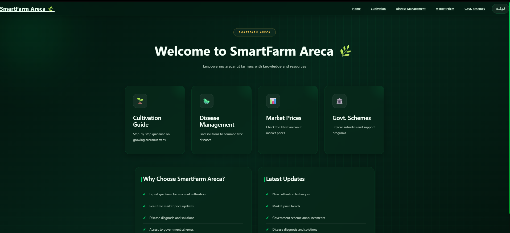
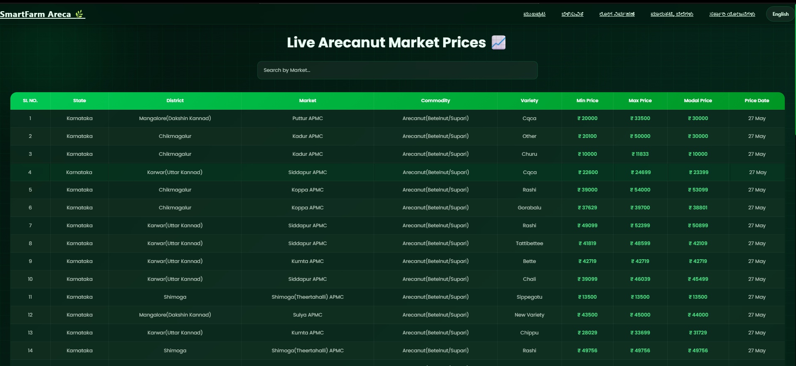

# 🌱 SmartFarm Areca

A modern full-stack smart agriculture platform developed for areca nut farmers to simplify cultivation guidance, disease management, government schemes awareness, and market price tracking.

---

# 🚀 Project Overview

SmartFarm Areca is a farmer-friendly web application that helps farmers access important agricultural information digitally through a clean and responsive interface.

The platform provides:

- 🌿 Cultivation guidance
- 🦠 Disease management support
- 📜 Government schemes information
- 💹 Real-time market prices
- 📱 Easy and responsive user experience

---

# 🛠️ Tech Stack

## Frontend
- React JS
- HTML5
- CSS3
- JavaScript

## Backend
- Spring Boot
- REST API
- Java

## Database
- MySQL

---

# ✨ Features

✅ Responsive modern UI  
✅ Smart cultivation guidance  
✅ Disease management support  
✅ Government schemes information  
✅ Market price updates  
✅ Farmer-friendly navigation  
✅ Full-stack architecture using React + Spring Boot  

---

# 📸 Project Screenshots

## 🏠 Home Page



---

## 🌿 Cultivation Module

### Cultivation Page 1


### Cultivation Page 2


### Cultivation Page 3


---

## 🦠 Disease Management Module

### Disease Page 1


### Disease Page 2


### Disease Page 3


---

## 📜 Government Schemes Module

### Schemes Page 1


### Schemes Page 2


---

## 💹 Market Prices Module



---

# ⚙️ Installation & Setup

## Clone Repository

```bash
git clone https://github.com/YOUR_USERNAME/smartfarm-areca.git
